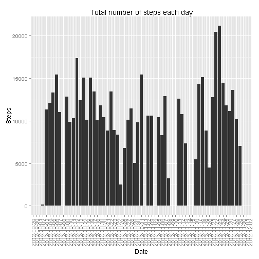
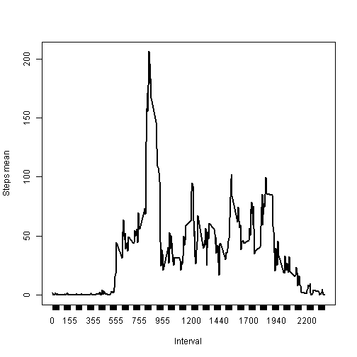
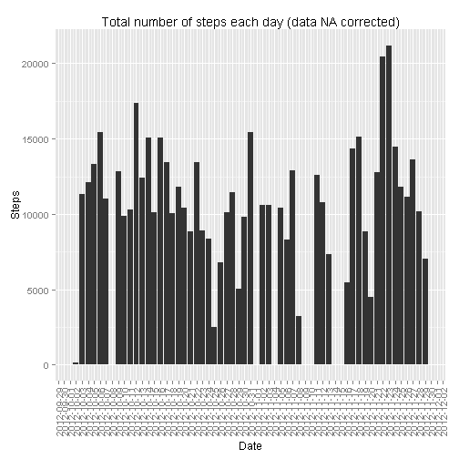
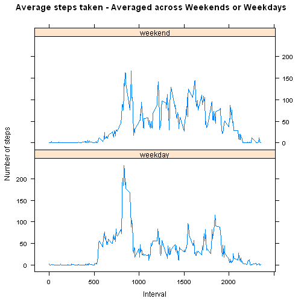

## Loading and preprocessing the data
First unzip the activity file and then load the data in R. To unzip the file make sure you load the appropriate __utils__ package.

* Load the __utils__ package
* unzip the __activity.zip__ file
* read the __activity.csv__ file into the data variable
* display the head of the __data__ variable


```r
# Load the utils library
library(utils)

# Unzip the activity.csv file
unzip("activity.zip")

# 1. Load the activity.csv file in R
data <- read.csv("activity.csv", header=TRUE, na.strings="NA")

# Display the head of data variable
head(data)
```


## What is mean total number of steps taken per day?

### For this part missing values are ignored

* Load into __dataValid__ variable values from __data__ variable with __non NA__ in the __step__ column
* Display the head of __dataValid__ variable


```r
# Get only valid data
dataValid <- data[!is.na(data$steps),]

# Display the head of dataValid variable
head(dataValid)
```

```
##     steps       date interval
## 289     0 2012-10-02        0
## 290     0 2012-10-02        5
## 291     0 2012-10-02       10
## 292     0 2012-10-02       15
## 293     0 2012-10-02       20
## 294     0 2012-10-02       25
```

* Calculate the total number of step taken per day and save the result into the __stepByDay__ variable
* Update the __date__ column of the __stepByDay__ variable with a Date type vale
* Load the __ggplot2__ package
* Plot an histogram with the total number of steps taken each day


```r
# 1. Calculate the total number of steps taken per day aggregating the data by date. Then get only date and steps columns
stepsByDay <- aggregate(. ~ date, data=dataValid[,1:2], FUN=sum)

# Convert to Date the date column
stepsByDay$date <- as.Date(stepsByDay$date)

# Load the ggplot2 package
library(ggplot2)
```

```
## Warning: package 'ggplot2' was built under R version 3.1.3
```

```r
# 2. Draw an histogram with the total number of steps taken each day
q <- ggplot(stepsByDay, aes(x=date, y=steps), type="l") 
q <- q + geom_bar(stat="identity") + scale_x_date(breaks="day") 
q <- q + theme(axis.text.x=element_text(angle=90,hjust=1,vjust=0.5))
q + xlab("Date") + ylab("Steps") + ggtitle("Total number of steps each day")
```

 

* Calculate the __mean__ value of the total number of steps taken per day and save the result into the __meanStep__ variable
* Calculate the __median__ value of the total number of steps taken per day and save the result into the __medianSteps__ variable
* Report the __mean__ and the __median__ values


```r
# 3. Calculate and report the mean and median of the total number of steps taken per day
meanSteps <- mean(stepsByDay$steps)
medianSteps <- median(stepsByDay$steps)

# Report mean and median
print(paste('Mean of the total number of steps taken per day:', round(meanSteps, 2), sep=' '))
```

```
## [1] "Mean of the total number of steps taken per day: 10766.19"
```

```r
print(paste('Median of the total number of steps taken per day:', medianSteps, sep=' '))
```

```
## [1] "Median of the total number of steps taken per day: 10765"
```

## What is the average daily activity pattern?

* Calculate the __mean__ across all days of the 5-minute interval and save the result into the __stepsAverageByInterval__ variable
* Plot the result saved into the __stepsAverageByInterval__ variable
* Report the 5-minute interval which contains the __maximum__ number of steps


```r
# 1. Make a time series plot (i.e. type = "l") of the 5-minute interval (x-axis) and the average number of steps taken, averaged across all days (y-axis)
stepsAverageByInterval <- aggregate(. ~ interval, data=data[,c(1,3)], FUN=mean)

# Plot the result
plot(stepsAverageByInterval$interval, stepsAverageByInterval$steps, type="l", lwd=2, xlab="Interval", ylab="Steps mean", xaxt="n")
axis(side = 1, at = stepsAverageByInterval$interval)
```

 

* Report the maximum number of steps


```r
# 2. Print which 5-minute interval, on average across all the days in the dataset, contains the maximum number of steps
print(stepsAverageByInterval[which.max(stepsAverageByInterval$steps),])
```

```
##     interval    steps
## 104      835 206.1698
```

Which 5-minute interval, on average across all the days in the dataset, contains the maximum number of steps?
The __835th__ interval is the one during which the maximum number of steps are performed (__206 steps__)

## Imputing missing values

* Report the number of rows containing missing values
* Substitute NA values with the mean value calculated on all days of the corresponding 5-minute interval and save the updated datase into the __dataNACorrected__ variable
* Calculate the total number of steps taken per day and save the result into the __stepsByDayNACorrected__ variable
* Plot a histogram with the total number of steps taken each day
* Calculate the __mean__ value of the total number of steps taken per day and save the result into the __meanStepsCorrected__ variable
* Calculate the __median__ value of the total number of steps taken per day and save the result into the __medianStepsCorrected__ variable
* Report the __mean__ and the __median__ values


```r
# 1. Calculate and report the total number of missing values in the dataset (i.e. the total number of rows with NAs)
print(paste('Number of rows containing NAs:', nrow(data[is.na(data$steps),]), sep=' '))
```

```
## [1] "Number of rows containing NAs: 2304"
```

```r
# 2-3. Imput NA values using the simple strategy of substituting the value with the mean of all days for that 5-minutes period. Create a new dataset with the mean already calculated in the stepsAverageByInterval var for NA values and the original value otherwise
dataNACorrected <- transform(data, steps=ifelse(is.na(data$steps), stepsAverageByInterval$steps[match(data$interval, stepsAverageByInterval$interval)], data$steps))

# Calculate the total number of steps taken per day aggregating the data by date. Then get only date and steps columns
stepsByDayNACorrected <- aggregate(. ~ date, data=dataNACorrected[,1:2], FUN=sum)

# 4. Make a histogram of the total number of steps taken each day and Calculate and report the mean and median total number of steps taken per day.
q1 <- ggplot(stepsByDayNACorrected, aes(x=date, y=steps), type="l") 
q1 <- q + geom_bar(stat="identity")
q1 <- q + theme(axis.text.x=element_text(angle=90,hjust=1,vjust=0.5))
q1 + xlab("Date") + ylab("Steps") + ggtitle("Total number of steps each day (data NA corrected)")
```

 

```r
# Calculate and report the mean and median of the total number of steps taken per day (data NA corrected)
meanStepsCorrected <- mean(stepsByDayNACorrected$steps)
medianStepsCorrected <- median(stepsByDayNACorrected$steps)

# Report mean and median
print(paste('Mean of the total number of steps taken per day:', round(meanStepsCorrected, 2), sep=' '))
```

```
## [1] "Mean of the total number of steps taken per day: 10766.19"
```

```r
print(paste('Median of the total number of steps taken per day:', medianStepsCorrected, sep=' '))
```

```
## [1] "Median of the total number of steps taken per day: 10766.1886792453"
```

Do these values differ from the estimates from the first part of the assignment?
Not much.

What is the impact of imputing missing data on the estimates of the total daily number of steps?
Not a substantial impact, the histogram doesn't change much.

## Are there differences in activity patterns between weekdays and weekends?

* Load the __dplyr__ package
* Set the english locale in order to make sure the comparison is with english weekdays names
* Add the __dayType__ column to the dataset with a __weekend__ or __weekday__ value based on the day type
* Calculate the mean value of the total number of steps taken by day divided for day type and save the result into the __dataByDayType__ variable
* Load the __lattice__ package
* Draw a panel plot containing a time series plot of the 5-minute interval (x-axis) and the average number of steps taken, averaged across all weekday days or weekend days (y-axis)


```r
# Load the dplyr package
library(dplyr)
```

```
## Warning: package 'dplyr' was built under R version 3.1.3
```

```
## 
## Attaching package: 'dplyr'
## 
## The following object is masked from 'package:stats':
## 
##     filter
## 
## The following objects are masked from 'package:base':
## 
##     intersect, setdiff, setequal, union
```

```r
## Set the locale based on the operating system (to get x axis in english)
if (.Platform$OS.type == "unix") {
    Sys.setlocale("LC_TIME", "en_US.UTF-8")
} else {
    Sys.setlocale("LC_TIME", "English")
}
```

```
## [1] "English_United States.1252"
```

```r
# 1. Create a new factor variable in the dataset with two levels - "weekday" and "weekend" indicating whether a given date is a weekday or weekend day.
dataNACorrected$dayType <- ifelse(weekdays(as.Date(dataNACorrected$date)) %in% c("Saturday", "Sunday"), "weekend", "weekday")

## Calculate the mean value of the total number of steps taken by day divided for day type 
dataByDayType <- aggregate(steps ~ interval+dayType, data=dataNACorrected, FUN=mean)

## Load the lattice library
library(lattice)
```

```
## Warning: package 'lattice' was built under R version 3.1.3
```

```r
## 2. Make a panel plot containing a time series plot (i.e. type = "l") of the 5-minute interval (x-axis) and the average number of steps taken, averaged across all weekday days or weekend days (y-axis).
xyplot(steps ~ interval | dayType, dataByDayType, layout=c(1,2), type="l", color="blue", xlab="Interval", ylab="Number of steps", main="Average steps taken - Averaged across Weekends or Weekdays")
```

 

Are there differences in activity patterns between weekdays and weekends?
The plot indicates that the subject performs more steps during weekends.
